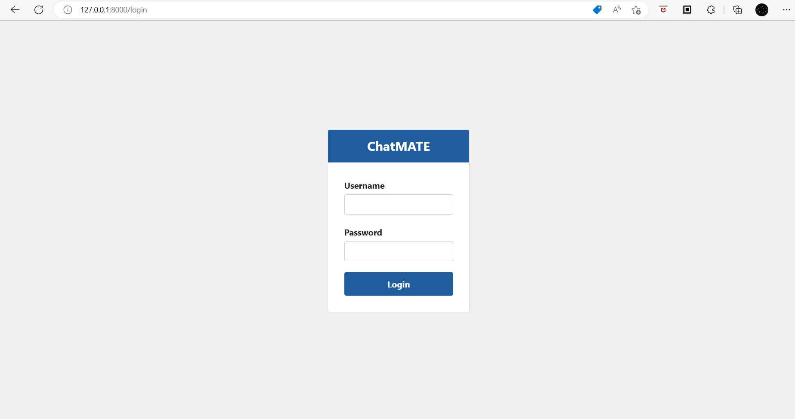
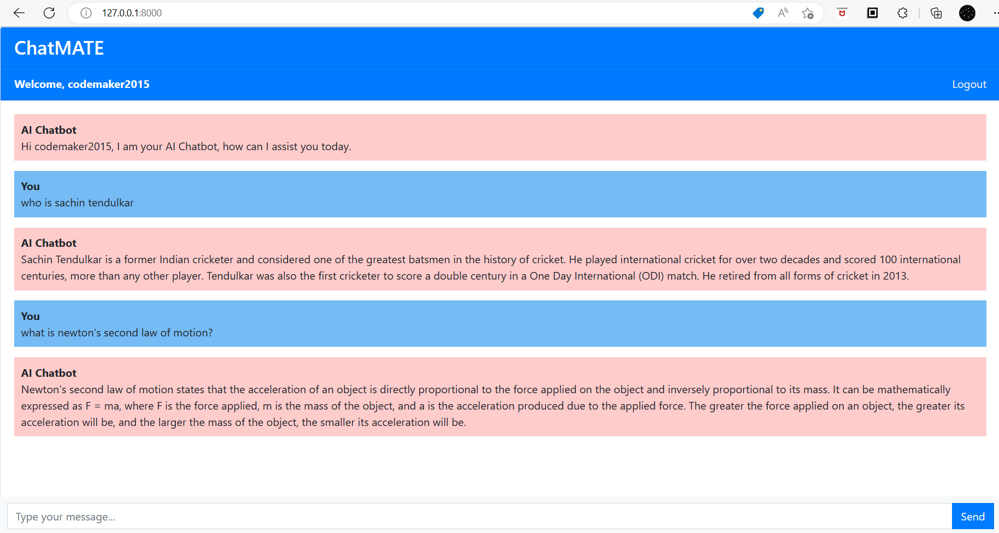

# ChatMATE Django
AI Chatbot in Django powered by OpenAI

## Demos




## Run the app
- Install the dependencies
```
pip install Django openai
```
or
```
pip install -r requirements.txt
```
- Run the project using the following command
```
python manage.py runserver
``` 

## Libraries used

This app is built using the following Python libraries:
- Django
- OpenAI

## How to Get OpenAI key ?

Open platform.openai.com.
Click on your name or icon option which is located on the top right corner of the page and select “API Keys” or click on the link -> Account API Keys -> OpenAI API.
Click on create new secret key button to create a new openai key.